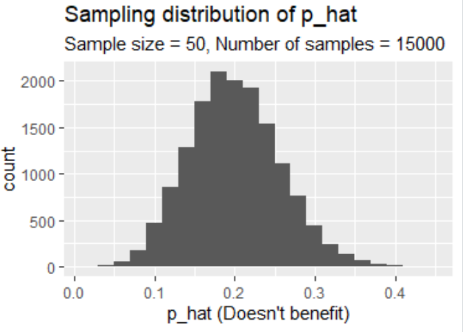

```{r global_options, include=FALSE}
knitr::opts_chunk$set(eval = TRUE, results = FALSE, fig.show = "hide", message = FALSE, warning = FALSE)
set.seed(1234)
```

In this lab, you will investigate the ways in which the statistics from a random 
sample of data can serve as point estimates for population parameters. We're 
interested in formulating a *sampling distribution* of our estimate in order 
to learn about the properties of the estimate, such as its distribution.

<div id="boxedtext">
**Setting a seed:** We will take some random samples and build sampling distributions
in this lab, which means you should set a seed at the start of your lab. If this
concept is new to you, review the lab on probability.
</div>

## Getting Started

### Load packages

In this lab, we will explore and visualize the data using the **tidyverse** suite of packages. 
We will also use the **infer** package for resampling.

Let's load the packages.

```{r load-packages, message=FALSE}
library(tidyverse)
library(openintro)
library(infer)
library(shiny)
```

### Creating a reproducible lab report

To create your new lab report, in RStudio, go to New File -> R Markdown... Then, choose From Template and then choose `Lab Report for OpenIntro Statistics Labs` from the list of templates.

### The data

A 2019 Gallup report states the following:

>The premise that scientific progress benefits people has been embodied in discoveries throughout the ages -- from the development of vaccinations to the explosion of technology in the past few decades, resulting in billions of supercomputers now resting in the hands and pockets of people worldwide. Still, not everyone around the world feels science benefits them personally. 
>
>**Source:** [World Science Day: Is Knowledge Power?](https://news.gallup.com/opinion/gallup/268121/world-science-day-knowledge-power.aspx)

The Wellcome Global Monitor finds that 20% of people globally do not believe that the work scientists do benefits people like them.
In this lab, you will assume this 20% is a true population proportion and learn about how sample proportions can vary from sample to sample by taking smaller samples from the population. 
We will first create our population assuming a population size of 100,000. 
This means 20,000 (20%) of the population think the work scientists do does not 
benefit them personally and the remaining 80,000 think it does.

```{r}
global_monitor <- tibble(
  scientist_work = c(rep("Benefits", 80000), rep("Doesn't benefit", 20000))
)

```

The name of the data frame is `global_monitor` and the name of the variable that contains responses to the question *"Do you believe that the work scientists do benefit people like you?"* is `scientist_work`.

We can quickly visualize the distribution of these responses using a bar plot.

```{r bar-plot-pop, fig.height=2.5, fig.width=10}
ggplot(global_monitor, aes(x = scientist_work)) +
  geom_bar() +
  labs(
    x = "", y = "",
    title = "Do you believe that the work scientists do benefit people like you?"
  ) +
  coord_flip() 
```

We can also obtain summary statistics to confirm we constructed the data frame correctly.

```{r summ-stat-pop, results = TRUE}
global_monitor %>%
  count(scientist_work) %>%
  mutate(p = n /sum(n))
```

## The unknown sampling distribution

In this lab, you have access to the entire population, but this is rarely the case in real life. 
Gathering information on an entire population is often extremely costly or impossible. 
Because of this, we often take a sample of the population and use that to understand the properties of the population.

If you are interested in estimating the proportion of people who don't think the work scientists do benefits them, you can use the `sample_n` command to survey the population.

```{r samp1}
samp1 <- global_monitor %>%
  sample_n(50)

ggplot(data = samp1, aes(x=scientist_work))+
  geom_bar()
```

This command collects a simple random sample of size 50 from the `global_monitor` dataset, and assigns the result to `samp1`. This is similar to randomly drawing names from a hat that contains the names of all in the population. Working with these 50 names is considerably simpler than working with all 100,000 people in the population.

1.  Describe the distribution of responses in this sample. How does it compare to the 
    distribution of responses in the population. **Hint:** Although the `sample_n` 
    function takes a random sample of observations (i.e. rows) from the dataset, 
    you can still refer to the variables in the dataset with the same names. Code 
    you presented earlier for visualizing and summarising the population data will 
    still be useful for the sample, however be careful to not label your proportion 
    `p` since you're now calculating a sample statistic, not a population parameters. 
    You can customize the label of the statistics to indicate that it comes from 
    the sample.

If you're interested in estimating the proportion of all people who do not believe that the work scientists do benefits them, but you do not have access to the population data, your best single guess is the sample mean.

```{r phat-samp1}
samp1 %>%
  count(scientist_work) %>%
  mutate(p_hat = n /sum(n))
```

```{r inline-calc, include=FALSE}
# For use inline below
samp1_p_hat <- samp1 %>% 
  count(scientist_work) %>% 
  mutate(p_hat = n /sum(n)) %>% 
  filter(scientist_work == "Doesn't benefit") %>% 
  pull(p_hat) %>% 
  round(2)
```

Depending on which 50 people you selected, your estimate could be a bit above or a bit below the true population proportion of `r samp1_p_hat`. In general, though, the sample proportion turns out to be a pretty good estimate of the true population proportion, and you were able to get it by sampling less than 1% of the population.

1.  Would you expect the sample proportion to match the sample proportion of another student's sample? Why, or why not? If the answer is no, would you expect the proportions to be somewhat different or very different? Ask a student team to confirm your answer.

*Because we are drawing random samples, I would not expect another student's sample proportion to be identical to my own.*

*Given n = 50 observations in each of our samples, I would expect to see moderate differences in the proportions (e.g., < 20%).*

1.  Take a second sample, also of size 50, and call it`samp2`. How does the sample proportion of `samp2` compare with that of `samp1`? 

*In my case, the mean of each sample proportion (samp1 & samp2) fell within 10% of each other.* 

Suppose we took two more samples, one of size 100 and one of size 1000. Which would you think would provide a more accurate estimate of the population proportion?

*I would expect a more accurate estimate of the sample proportion with n=1000.*
    
```{r}
set.seed(111)

samp2 <- global_monitor %>%
  sample_n(50)

samp2 %>%
  count(scientist_work) %>%
  mutate(p_hat = n /sum(n)) #---> 0.76 Benefits, 0.24 Doesnt Benefit
```


Not surprisingly, every time you take another random sample, you might get a different sample proportion. It's useful to get a sense of just how much variability you should expect when estimating the population mean this way. The distribution of sample proportions, called the *sampling distribution (of the proportion)*, can help you understand this variability.

In this lab, because you have access to the population, you can build up the sampling distribution for the sample proportion by repeating the above steps many times. 
Here, we use R to take 15,000 different samples of size 50 from the population, calculate the proportion of responses in each sample, filter for only the *Doesn't benefit* responses, and store each result in a vector called `sample_props50`. 
Note that we specify that `replace = TRUE` since sampling distributions are constructed by sampling with replacement.

```{r iterate}
sample_props50 <- global_monitor %>%
                    rep_sample_n(size = 50, reps = 15000, replace = TRUE) %>%
                    count(scientist_work) %>%
                    mutate(p_hat = n /sum(n)) %>%
                    filter(scientist_work == "Doesn't benefit")
```

And we can visualize the distribution of these proportions with a histogram.

```{r fig.show="hide"}
ggplot(data = sample_props50, aes(x = p_hat)) +
  geom_histogram(binwidth = 0.02) +
  labs(
    x = "p_hat (Doesn't benefit)",
    title = "Sampling distribution of p_hat",
    subtitle = "Sample size = 50, Number of samples = 15000"
  )
```

Next, you will review how this set of code works.

1.  How many elements are there in `sample_props50`?  Describe the sampling distribution, and be sure to specifically note its center. Make sure to include a plot of the distribution in your answer.

*It's not entirely clear to me what the term "elements" refers too in this instance. If it is the number of proportions sampled (I think that is the case), then the answer is 15000. If it refers to the sum of observations across samples, then the answer is 225000.* 

*The sampling distribution appears normally distributed with a mean probability (p_hat) of ~ 0.2. In terms of shape, It is unimodal as well as symmetrical.*



## Interlude: Sampling distributions

The idea behind the `rep_sample_n` function is *repetition*. Earlier, you took a single sample of size `n` (50) from the population of all people in the population. 
With this new function, you can repeat this sampling procedure `rep` times in order to build a distribution of a series of sample statistics, which is called the **sampling distribution**. 

Note that in practice one rarely gets to build true sampling distributions, because one rarely has access to data from the entire population. 

Without the `rep_sample_n` function, this would be painful. We would have to manually run the following code 15,000 times 

```{r sample-code}
global_monitor %>%
  sample_n(size = 50, replace = TRUE) %>%
  count(scientist_work) %>%
  mutate(p_hat = n /sum(n)) %>%
  filter(scientist_work == "Doesn't benefit")
```

as well as store the resulting sample proportions each time in a separate vector.

Note that for each of the 15,000 times we computed a proportion, we did so from a **different** sample!

1.  To make sure you understand how sampling distributions are built, and exactly
    what the `rep_sample_n` function does, try modifying the code to create a
    sampling distribution of **25 sample proportions** from **samples of size 10**, 
    and put them in a data frame named `sample_props_small`. Print the output. 
    How many observations are there in this object called `sample_props_small`? 
    What does each observation represent?
    
*There are 25 observations in the rep_sample_n dataframe. Each observation represents the mean of 10 samples drawn (with replacement) from the sample population. Collectively, the 25 observations form a sampling distribution*


```{r}
sample_props_small <- global_monitor %>%
                    rep_sample_n(size = 10, reps = 25, replace = TRUE) %>%
                    count(scientist_work) %>%
                    mutate(p_hat = n /sum(n)) %>%
                    filter(scientist_work == "Doesn't benefit")

 ggplot(data = sample_props_small, aes(x = p_hat)) +
  geom_histogram(binwidth = 0.02)

```

## Sample size and the sampling distribution

Mechanics aside, let's return to the reason we used the `rep_sample_n` function: to compute a sampling distribution, specifically, the sampling distribution of the proportions from samples of 50 people. 

```{r hist, fig.show='hide'}
ggplot(data = sample_props50, aes(x = p_hat)) +
  geom_histogram(binwidth = 0.02)
```

The sampling distribution that you computed tells you much about estimating the true proportion of people who think that the work scientists do doesn't benefit them. 
Because the sample proportion is an unbiased estimator, the sampling distribution is centered at the true population proportion, and the spread of the distribution indicates how much variability is incurred by sampling only 50 people at a time from the population.

In the remainder of this section, you will work on getting a sense of the effect that sample size has on your sampling distribution.

1.  Use the app below to create sampling distributions of proportions of 
    *Doesn't benefit* from samples of size 10, 50, and 100. Use 5,000 simulations. 

    What does each observation in the sampling distribution represent? 
    
*Each observation represents the mean of 10 probability samples taken from the sample population*
    
    How does the mean, standar error, and shape of the sampling distribution 
    change as the sample size increases? 

*As the sample size increases the mean converges to 0.2 and the standard error steadily decreases. And the shape of the sample distribution approximates the normal distribution (unimodal and symmetrical).*
    
    How (if at all) do these values change if you increase the number of simulations?
    (You do not need to include plots in your answer.)

*The mean reaches a threshold of 0.2 with a sample size as low as 18. The standard error continues to decrease (at smaller increments) and the shape of the distribution becomes increasingly compact (i.e., range of p_hat, Doesn't Benefit).*
    
    
```{r shiny, echo=FALSE, eval=FALSE, results = TRUE}
# This R chunk will only run in interactive mode.
shinyApp(
  ui <- fluidPage(
    
    # Sidebar with a slider input for number of bins 
    sidebarLayout(
      sidebarPanel(
        
        selectInput("outcome",
                    "Outcome of interest:",
                    choices = c("Benefits", "Doesn't benefit"),
                    selected = "Doesn't benefit"),
        
        numericInput("n_samp",
                     "Sample size:",
                     min = 1,
                     max = nrow(global_monitor),
                     value = 30),
        
        numericInput("n_rep",
                     "Number of samples:",
                     min = 1,
                     max = 30000,
                     value = 15000),
        
        hr(),
        
        sliderInput("binwidth",
                    "Binwidth:",
                    min = 0, max = 0.5,
                    value = 0.02,
                    step = 0.005)
        
      ),
      
      # Show a plot of the generated distribution
      mainPanel(
        plotOutput("sampling_plot"),
        textOutput("sampling_mean"),
        textOutput("sampling_se")
      )
    )
  ),
  
  server <- function(input, output) {
    
    # create sampling distribution
    sampling_dist <- reactive({
      global_monitor %>%
        rep_sample_n(size = input$n_samp, reps = input$n_rep, replace = TRUE) %>%
        count(scientist_work) %>%
        mutate(p_hat = n /sum(n)) %>%
        filter(scientist_work == input$outcome)
    })
    
    # plot sampling distribution
    output$sampling_plot <- renderPlot({
      
      ggplot(sampling_dist(), aes(x = p_hat)) +
        geom_histogram(binwidth = input$binwidth) +
        xlim(0, 1) +
        labs(
          x = paste0("p_hat (", input$outcome, ")"),
          title = "Sampling distribution of p_hat",
          subtitle = paste0("Sample size = ", input$n_samp, " Number of samples = ", input$n_rep)
        ) +
        theme(plot.title = element_text(face = "bold", size = 16))
    })
    
    ggplot(data = sample_props50, aes(x = p_hat)) +
      geom_histogram(binwidth = 0.02) +
      labs(
        x = "p_hat (Doesn't benefit)",
        title = "Sampling distribution of p_hat",
        subtitle = "Sample size = 50, Number of samples = 15000"
      )
    
    # mean of sampling distribution
    output$sampling_mean <- renderText({
      paste0("Mean of sampling distribution = ", round(mean(sampling_dist()$p_hat), 2))
    })
    
    # mean of sampling distribution
    output$sampling_se <- renderText({
      paste0("SE of sampling distribution = ", round(sd(sampling_dist()$p_hat), 2))
    })
  },
  
  options = list(height = 900) 
)
```

* * *

## More Practice

So far, you have only focused on estimating the proportion of those you think the work scientists doesn't benefit them. Now, you'll try to estimate the proportion of those who think it does.

Note that while you might be able to answer some of these questions using the app,
you are expected to write the required code and produce the necessary plots and
summary statistics. You are welcome to use the app for exploration.

1.  Take a sample of size 15 from the population and calculate the proportion of 
    people in this sample who think the work scientists do enchances their lives. 
    Using this sample, what is your best point estimate of the population proportion 
    of people who think the work scientists do enchances their lives?
    
*Our best point estimate is the sample mean, which in this case is 0.82*
    
```{r}

set.seed(222)

s15 <- global_monitor %>%
  sample_n(50)

ggplot(data = s15, aes(x=scientist_work))+
  geom_bar()

s15 %>%
  count(scientist_work) %>% # we count because the samples are names
  mutate(p_hat = n /sum(n))
```
    

1.  Since you have access to the population, simulate the sampling 
    distribution of proportion of those who think the work scientists do enchances 
    their lives for samples of size 15 by taking 2000 samples from the population 
    of size 15 and computing 2000 sample proportions. Store these proportions in 
    as `sample_props15`. Plot the data, then describe the shape of this sampling 
    distribution. Based on this sampling distribution, what would you guess the 
    true proportion of those who think the work scientists do enchances their lives 
    to be? Finally, calculate and report the population proportion.
    
*The plot of our sampling distribution unimodal and slightly left skewed. Values for p_hat range from 0.4 to 1.0. The standard error is 0.11* 

*From my sampling distribution plot, I estimate that the proportion of people who feel that scientists benefit their lives is 0.80 or 80% (rounded). My calculation fo the sampling distribution mean (mean = 0.80) confirms this.*
    
```{r}
set.seed(333)

sample_props15 <- global_monitor %>%
  rep_sample_n(size = 15, reps = 2000, replace = TRUE) %>%
  count(scientist_work) %>%
  mutate(p_hat = n /sum(n)) %>%
  filter(scientist_work == "Benefits")

ggplot(data = sample_props15, aes(x = p_hat)) +
  geom_histogram(binwidth = 0.02)
 
# calculate mean of sampling distribution
 
(sp15_mean <-mean(sample_props15$p_hat))  # 0.797

# calculate the standard error of the sampling distribution

sderr <- sd(sample_props15$p_hat)/sqrt(sp15_mean) # --> 0.11

```


1.  Change your sample size from 15 to 150, then compute the sampling 
    distribution using the same method as above, and store these proportions in a 
    new object called `sample_props150`. Describe the shape of this sampling 
    distribution and compare it to the sampling distribution for a sample 
    size of 15. Based on this sampling distribution, what would you guess to 
    be the true proportion of those who think the work scientists do enchances 
    their lives?
    
  *The sample distribution plot is more compact (ranging from p_hat ~.65 to .88) and symmetrical about the mean. My estimate of the mean based on the plot remains at 0.799.* 
```{r}
set.seed(444)

sample_props150 <- global_monitor %>%
  rep_sample_n(size = 150, reps = 2000, replace = TRUE) %>%
  count(scientist_work) %>%
  mutate(p_hat = n /sum(n)) %>%
  filter(scientist_work == "Benefits")

ggplot(data = sample_props150, aes(x = p_hat)) +
  geom_histogram(binwidth = 0.02)
 
 # calculate mean of sampling distribution
 
(sp150_mean <-mean(sample_props150$p_hat))  # 0.799

sd150 <- sd(sample_props150$p_hat)/sqrt(sp150_mean) # --> 0.037

```


1.  Of the sampling distributions from 2 and 3, which has a smaller spread?  If
    you're concerned with making estimates that are more often close to the 
    true value, would you prefer a sampling distribution with a large or small spread?

*As expected, distribution 3 displays a smaller spread (SE = 0.037) than distribution 2 (SE = 0.11). I would prefer a sampling distribution with a small spread (suggesting a larger sample size) when trying to constrain my estimates to the true value.* 

* * *
